# Motorparts Inventory

**Inventory, point of sale and sales tracking for small motorcycle parts shops.**
Zero dependencies: Node.js and its built-in SQLite. One file holds all the data, and there's no `npm install`.

**[▶ Live demo](https://motorparts-inventory-demo.up.railway.app)**: log in as **admin / admin123**. It resets on every deploy.

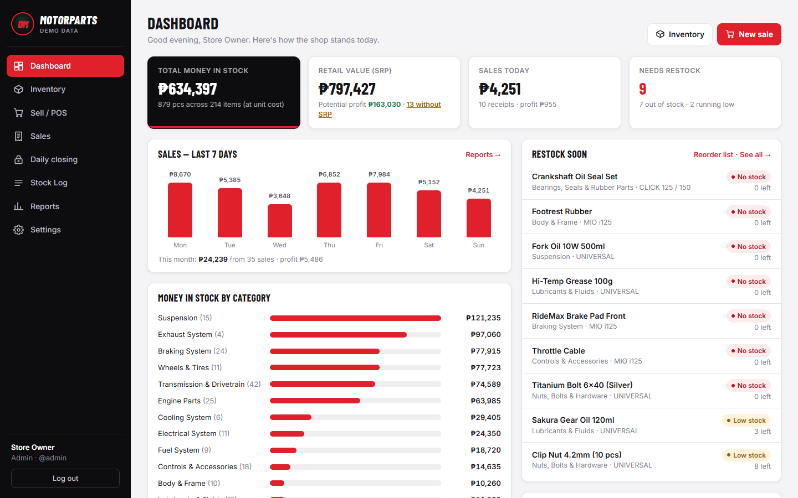

This started as a system built for a real motorparts shop in Bulacan, Philippines, and it runs there every day.
**Everything in this repository runs on generated demo data.** The catalog, brands, sales, customers and staff are made up
from templates and a fixed random seed, so nothing here belongs to the shop.

## Try it

```
git clone https://github.com/Matimbu/motorparts-inventory.git
cd motorparts-inventory
node server.js
```

Open http://localhost:3000 and log in as **admin / admin123** (or staff **jenny / staff1234**).
You need Node.js 22.13 or newer. The first start generates about 200 parts and two months of sales history.

## What it does

**At the counter**
- **Fits my bike.** Tap NMAX, Click, Aerox and so on to see every part that fits. It reads the shop's own "fits" notes, like `NMAX / AEROX` or `CLICK 125 / 150`, and brand-level fits (`HONDA`) count for that brand's bikes.
- **Fast POS.** Best sellers of the last 30 days come first, and `/` jumps to search from anywhere. It remembers the last payment method (Cash, GCash, Maya, COD).
- **Guard rails.** It won't sell more than you have, won't ring up an item at ₱0, and warns when a discount goes below cost.
- **Returns.** Return one item from a receipt (wrong fitment is common with parts). Stock goes back, and the refund counts on the day it's given.
- **Receipts** sized for 80mm and 58mm thermal printers, labeled as acknowledgement receipts.

**For the owner**
- **Dashboard** with money in stock, retail value, today's and this month's sales and profit, what to restock, and money per category.
- **Daily closing.** Totals per payment method and cashier. Count the cash drawer bill by bill and see if it's over or short, with a history of every closing and a printable Z-report.
- **Reports** for any date range: sales, gross profit and margin, best sellers, by category and payment method, all net of returns.
- **Reorder list** of low and out-of-stock items with suggested quantities and cost, copied ready to paste into Messenger for the supplier.
- **Stock log** of every delivery, sale, return, pull-out and count, with who did it.

**Keeping the shop's spreadsheet**
- **Google Sheet sync, read-only.** Many shops already keep their inventory in a Google Sheet. The app reads it through the sheet's "anyone with the link can view" export and never writes to it. A preview shows new items, changes and the new stock total before anything is applied.
- **POS sales survive a sync.** A stock count only changes when the sheet itself changed since the last sync.
- **Nothing is deleted.** Items that disappear from the sheet (usually renames) are hidden, so past sales keep their history.
- **Pricing gaps get caught.** Items without a selling price are flagged, and can be priced right from the list, one by one or all at a markup.

**Everywhere**
- **Phone-first.** Staff use it on their phones on the shop's Wi-Fi, and it installs to the home screen like an app.
- **Roles.** Staff sell, receive stock and edit items. Only an admin deletes items, voids sales and manages accounts.
- **Security.** Forced password change on first login, lockout after repeated wrong passwords, HTTPS-only cookies, and a strict Content Security Policy.

## What sets it apart

- **Runs anywhere, costs almost nothing.** No database server and no dependencies. It runs on the shop's PC for free, or online for about $5 a month.
- **It meets the shop where it is.** Instead of making the owner abandon their spreadsheet, it reads it, safely and one-way, and adds receipts, returns, closings and reports on top.
- **Built for how a parts shop sells.** Customers ask "may pang-Click kayo?", pay by GCash, return parts that don't fit, and the owner checks the numbers from home at night. The features follow that day.
- **Honest books.** Returns and voids restore stock, and refunds land on the day they happen. Every stock change is in the log with a name on it.

## Screenshots

| | |
|---|---|
| 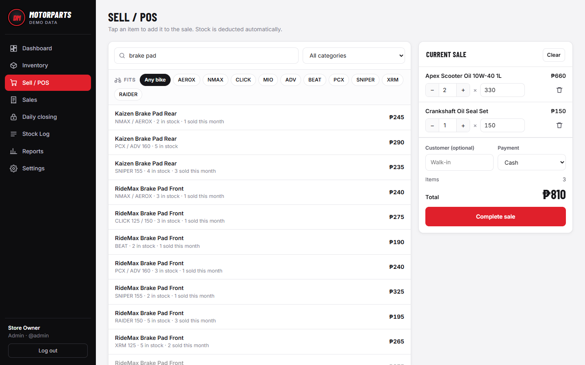 POS with a cart | 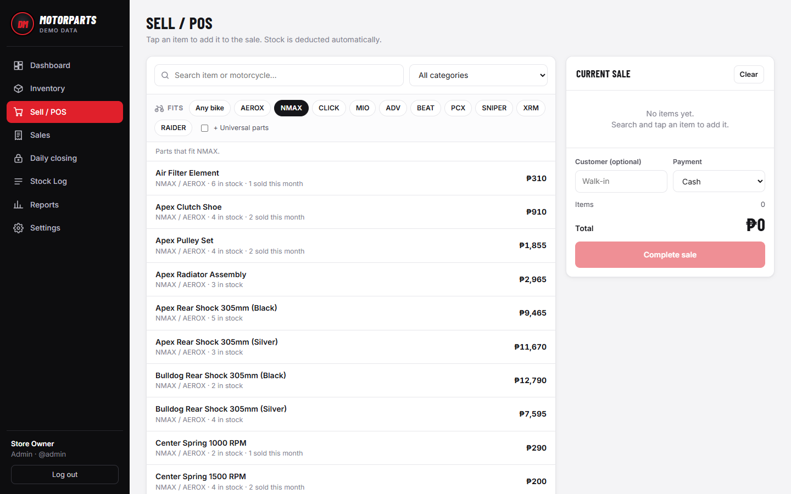 Parts that fit a chosen bike |
| 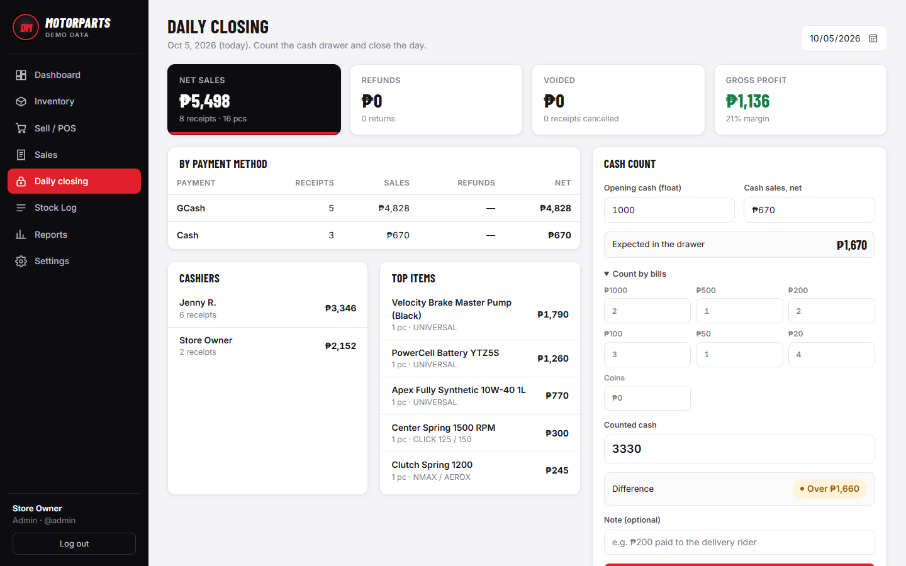 Daily closing and cash count | 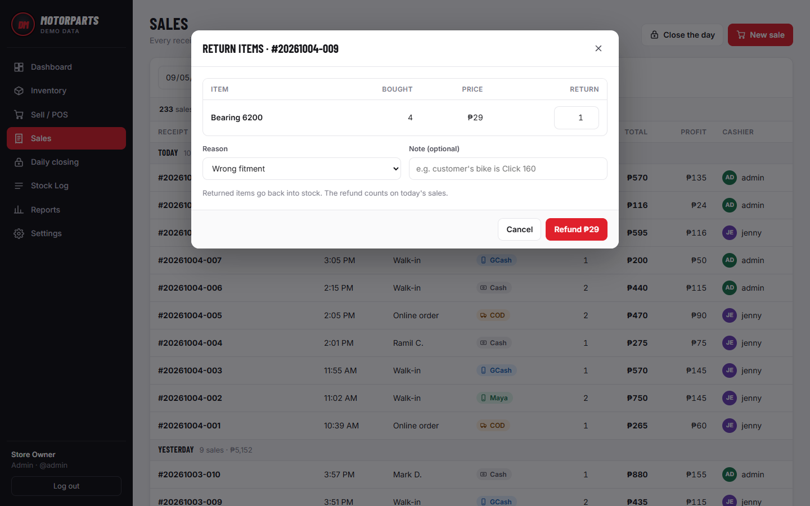 Returning an item from a receipt |
| 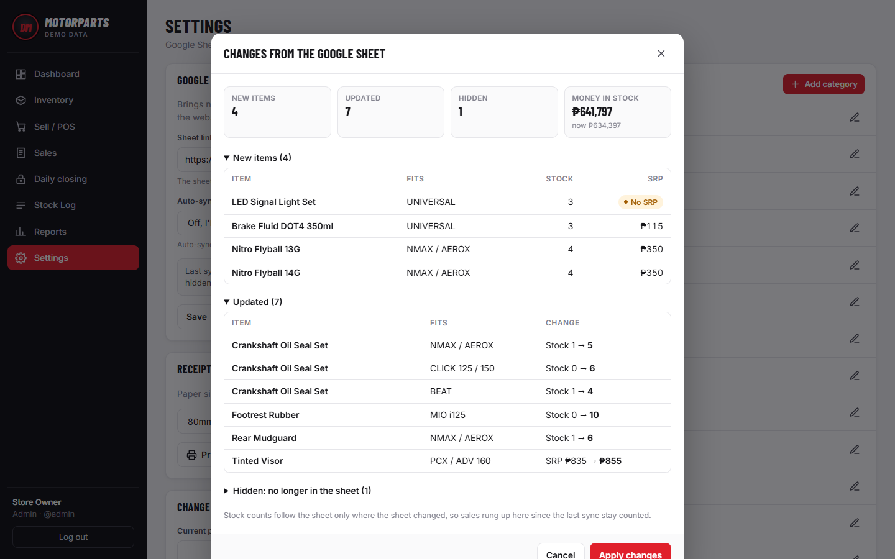 Google Sheet sync preview | 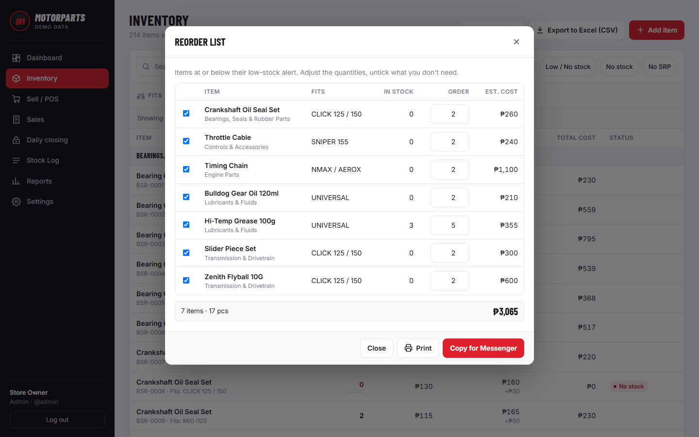 Reorder list for the supplier |
| 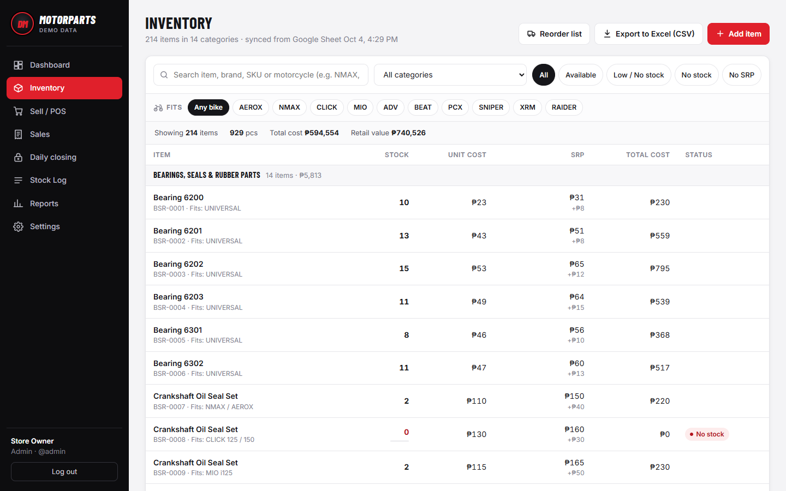 Inventory | 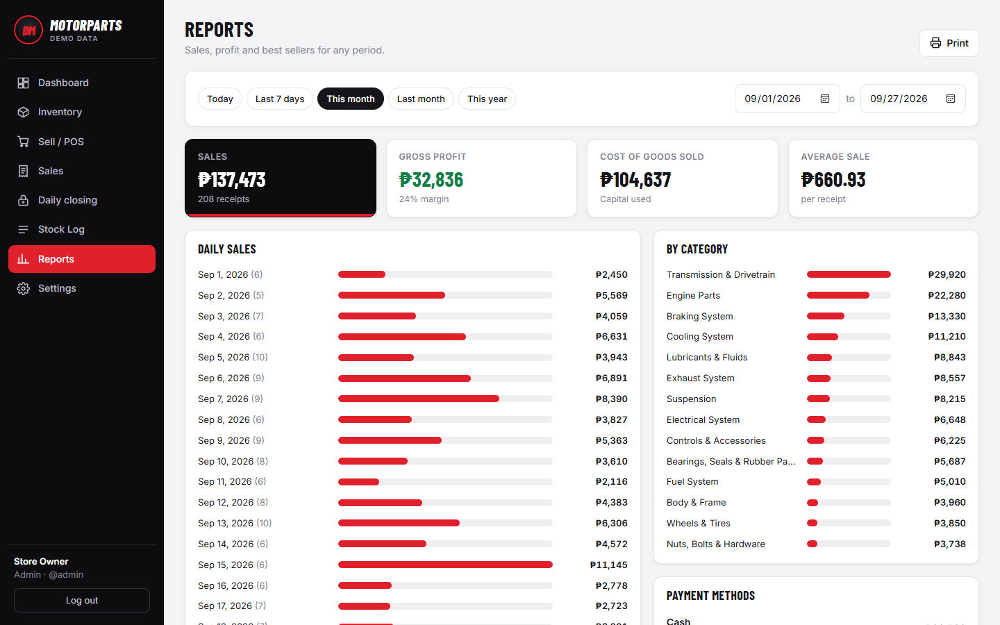 Reports |

| | | |
|---|---|---|
| 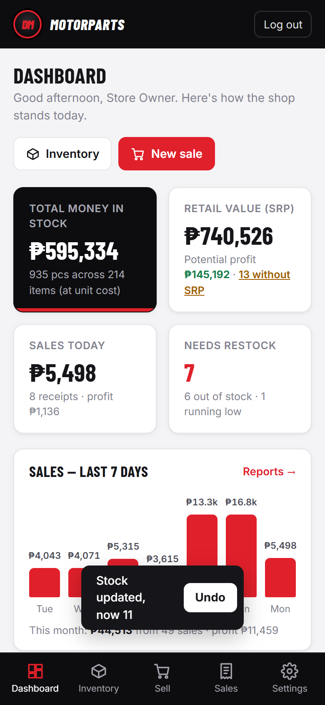 | 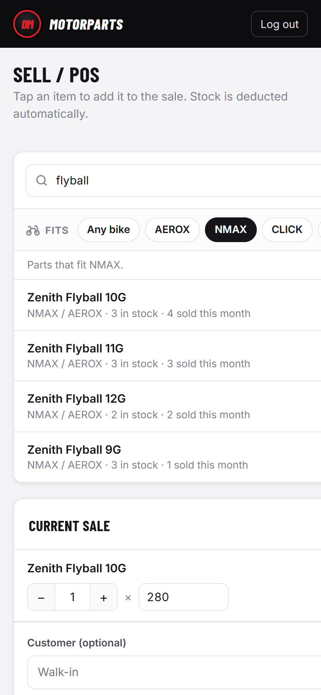 | 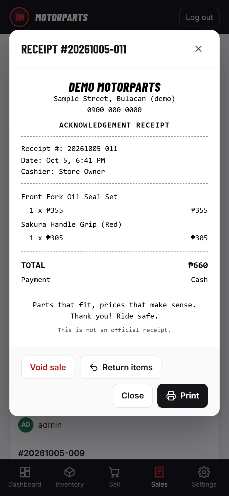 |

Every screen is in [`docs/screenshots`](docs/screenshots). They're regenerated with `node scripts/screenshots.js`.

## How it's built

- **Server:** one file, [`server.js`](server.js). Node's `http` and `node:sqlite`, a small JSON API, sessions with scrypt-hashed passwords.
- **Front end:** plain JavaScript with hash routing, [`public/app.js`](public/app.js) and [`public/styles.css`](public/styles.css). No framework and no build step.
- **Books:** a `ledger` view unions kept sales with refunds as negative amounts. Dashboards, reports and closings read from it, so every number is net of returns by construction.
- **Sheet sync:** each item remembers the last values it saw in the sheet. A field only changes when the sheet changed it, so the website and the sheet can both be used without undoing each other.
- **Time:** stored in UTC and shown in Philippine time (UTC+8) everywhere, so reports are right even on a server in another time zone.
- **Demo data:** [`demo.js`](demo.js) generates the catalog, two months of sales with weekend peaks and a realistic payment mix, deliveries, voids, closings and a demo Google Sheet.
- **Screenshots:** [`scripts/screenshots.js`](scripts/screenshots.js) drives a local Edge or Chrome over the DevTools protocol with Node's built-in WebSocket. Also zero dependencies.

## Running it for a real shop

1. Put the shop's details in `data/shop.json`. Copy [`data/demo/shop.json`](data/demo/shop.json) and change the name, address, phone and receipt text.
2. Either start empty with `DEMO=0`, or put a starting inventory in `data/seed.json`: a list of `{ category, name, compat, stock, cost, srp }`.
3. Change the admin password when asked on first login.

Demo data lives in its own file (`data/demo.db`), so it never mixes with real records. To host it online, the included `Dockerfile` and `railway.json` deploy to Railway. Mount a volume and set `DATA_DIR` to its path.

## License

All rights reserved. You're welcome to run the demo, read the code and learn from it. Please ask before reusing it in your own project.
